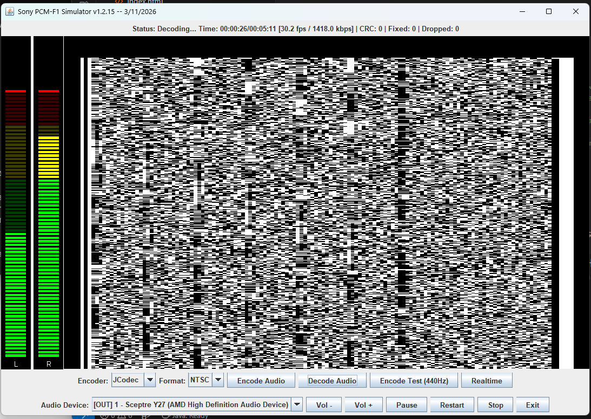

# Sony PCM-F1 Simulator

Welcome to the **Sony PCM-F1 Simulator**. This application provides a window into early digital audio. It allows you to encode 16-bit WAV files into a 1981-era EIAJ STC-007 NTSC video signal, ready to record onto physical VHS hardware. Conversely, it can decode ripped video captures and play them back in real-time.

> [!NOTE]
> This application was coded by Gemini 3.1 Pro and has not been tested on actual hardware or PCM encoded videos. It is meant primarily as a proof of concept and educational tool. If you are looking for a production-ready application, please use the original Sony PCM-F1.

---

## Anatomy of a PCM-F1 Video Frame

To understand how this encoder works, we must look at how digital data is mapped onto a television screen. An entire interlaced video frame (such as NTSC) is divided into specialized sections to allow VHS recording without data loss.

1.  **VBLANK (Vertical Blanking Interval):** The top 17 lines are forced to black. This originally allowed the CRT electron beam to reset and gives VCR switching heads time to align.
2.  **Control Word Header:** The first active line contains a repeating `0x3333` signature. A hardware decoder hunts for this to align its vertical phase clock.
3.  **PCM Audio Data Block:** The main part of the screen is a dense flickering matrix encompassing the raw 16-Bit interleaved PCM audio data, parities, and checksums.
4.  **Horizontal Pillarboxing:** Deep black borders prevent data loss due to *overscan* on older CRT displays.

### Inside a Single Row of Audio Data
Each of the 240 active audio lines contains exactly **137 bits** of data:

*   **STC Sync Pulse (9 Bits):** A `101010101` wave that calibrates the hardware clock.
*   **Audio Words (84 Bits):** Six 14-bit data words carrying the actual PCM sampled audio (interleaved L/R stereo pairs).
*   **Parity P/Q (28 Bits):** Error correction blocks used to reconstruct damaged audio from VHS dropouts.
*   **CRC-16 (16 Bits):** A checksum used to verify if the line was corrupted by noise.

---

## 1. Prerequisites & Installation

### Install Java Runtime Environment (JRE)
This software is a standalone Java Archive (`.jar`). You must have **Java 8 or newer** installed.
*   Download from the [Java Downloads Page](https://www.java.com/en/download/manual.jsp).
*   Install the **Windows Offline (64-bit)** version.

### Install FFmpeg (Optional, Highly Recommended)
While the app has built-in Java codecs for video streams, **FFmpeg** is required to multiplex a synchronous audio track into your final video file.

*   **Windows (Winget):** `winget install ffmpeg`
*   **Manual:** Download from [ffmpeg.org](https://ffmpeg.org/download.html).

---

## 2. Running the Simulator

### Option A: Double Click
If Java is correctly associated with `.jar` files, simply **Double-Click** `PCMF1Simulator.jar`.

### Option B: Command Line
If double-clicking fails, open a terminal (cmd/PowerShell) and run:
```bash
java -jar PCMF1Simulator.jar
```

---

## 3. Usage Instructions

### A. Encoding Audio to Video (For VHS Recording)
1.  Open the application and choose an **Encoder** (JCodec for pure Java, or FFmpeg for full audio/video muxing).
2.  Select your **Format** (NTSC for USA/Japan 44,056Hz, PAL for Europe 44,100Hz).
3.  Click **Encode Audio** and select your source file (`.WAV`, `.FLAC`, `.MP3`, etc.).
4.  The app will generate the video matrix in real-time. When complete, a `.mp4` will be saved in the same folder.

### B. Decoding Video to Audio (Realtime Playback)
1.  Click **Decode Audio** and select a valid STC-007 compliant MP4.
2.  The application will play the audio through your speakers in real-time, syncing to the video framerate.
3.  The GUI tracks corrected P/Q Parity dropout errors simulating hardware recovery.



---

## 4. Hardware VHS Recording

> [!CAUTION]
> **Attention Video Enthusiasts:** You cannot use cheap scaling "HDMI-to-RCA" converter boxes. These "smear" the picture, destroying the binary data.

To record successfully to tape, you must output a raw, unscaled **480i 15kHz signal** (e.g., using a Raspberry Pi's native composite jack).
